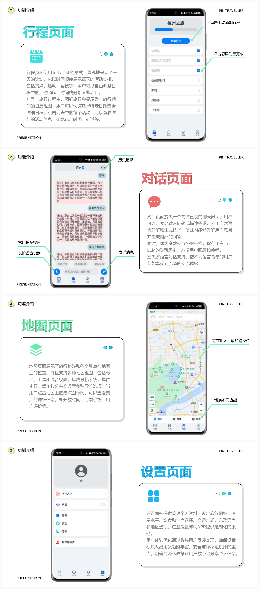

# 图钉旅行 (PinTravel)

<p align="center">
  
  
  
  
</p>


> 一款基于大语言模型的智能旅游攻略应用，为用户提供个性化、一站式旅行规划体验。

## 📖 项目简介

**图钉旅行**是一款基于开源鸿蒙（OpenHarmony API 9）原生开发的智能旅游攻略应用。通过集成百度大语言模型（ERNIE Lite），为用户提供个性化的旅行规划服务。用户只需通过简单的对话交互，即可获得详细的行程安排，并以直观的卡片和地图形式展示。

### 🎯 核心特色

- **一站式规划生成**：用户通过自然语言描述需求，系统自动生成完整的行程规划
- **个性化定制**：根据用户身体状况、时间、预算、偏好等信息提供定制化方案
- **多维度展示**：行程以卡片列表和地图两种形式直观呈现
- **智能语音交互**：支持语音输入，提升使用便捷性
- **"聊天即服务"设计理念**：通过对话即可完成所有操作，降低使用门槛

## 🏗️ 系统架构

```
┌─────────────────────────────────────────────────────────┐
│                      图钉旅行 APP                        │
├─────────────┬─────────────┬─────────────┬───────────────┤
│   对话系统   │   行程系统   │   地图系统   │  偏好设置系统  │
│   (chat)    │   (trip)    │   (map)     │  (settings)   │
├─────────────┴─────────────┴─────────────┴───────────────┤
│                    LLM 服务层                            │
│              (百度 ERNIE Lite API)                       │
└─────────────────────────────────────────────────────────┘
```

### 四大核心子系统

| 子系统                        | 功能描述                                                    |
| ----------------------------- | ----------------------------------------------------------- |
| **对话子系统 (chat)**         | 调用 LLM 进行行程内容的创建、规划、修改和完善，支持中英双语 |
| **行程子系统 (trip)**         | 以列表和地图形式展示规划日程，支持拖拽排序、编辑修改        |
| **地图子系统 (map)**          | 展示景点位置、路线规划，提供导航功能                        |
| **偏好设置子系统 (settings)** | 管理用户偏好（消费水平、饮食、住宿、交通方式等）            |

## 📱 应用展示




## 🚀 功能特性

### 1. 智能对话规划

- 自然语言交互，无需复杂操作
- 支持中英双语对话
- 对话历史自动保存
- 实时响应与智能问答
- 语音输入支持

### 2. 行程管理

- 清晰直观的 Todo List 展示
- 支持拖拽调整活动顺序
- 日历视图便于宏观把握行程
- 卡片展示详细信息（景点名称、活动时间、描述等）
- 中长期旅行支持日历视图

### 3. 地图导航

- 多种地图视图切换
- 景点位置标注
- 路线规划与导航
- 景点详情查询（名称、地址、开放时间等）

### 4. 个性化设置

- 个人资料管理
- 旅行偏好设定
- 消费水平配置
- 饮食/住宿偏好
- 安全与隐私保护

## 🛠️ 技术栈

| 技术         | 说明                |
| ------------ | ----------------- |
| **开发平台** | OpenHarmony (API 9) |
| **开发语言** | ArkTS               |
| **构建工具** | Hvigor              |
| **AI 模型**  | 百度 ERNIE Lite     |
| **测试框架** | @ohos/hypium        |

### 核心技术亮点

1. **提示词工程**：精心设计的 System Prompt 确保模型准确理解用户意图
2. **语音识别**：集成智能语音识别，将语音指令转化为文字
3. **JSON 结构化输出**：大模型输出结构化 JSON 文件，便于前端渲染
4. **三层架构设计**：高内聚低耦合，便于维护和扩展

## 📦 项目结构

```
PinTravel/
├── AppScope/                    # 应用全局配置
├── products/                    # 产品层
│   └── entry/                   # 应用入口模块
│       └── src/                 # 源代码
├── features/                    # 功能层（Har包）
│   ├── chat/                    # 对话模块
│   │   ├── src/
│   │   └── index.ets
│   ├── trip/                    # 行程模块
│   │   ├── src/
│   │   └── index.ets
│   ├── map/                     # 地图模块
│   │   ├── src/
│   │   └── index.ets
│   └── settings/                # 设置模块
│       ├── src/
│       └── index.ets
├── hvigor/                      # 构建脚本
├── build-profile.json5          # 构建配置
├── oh-package.json5             # 项目配置
└── hvigorw / hvigorw.bat        # 构建命令
```

## 🔧 开发环境

| 工具            | 版本要求   |
| --------------- | ---------- |
| DevEco Studio   | 4.1.3.600+ |
| OpenHarmony SDK | API 9+     |
| Hvigor          | 内置       |

## 📥 安装与运行

### 克隆项目

```bash
git clone https://github.com/hexwarrior6/PinTravel.git
cd PinTravel
```

### 导入项目

1. 打开 DevEco Studio
2. 选择 `Open Project` 导入项目目录
3. 等待项目同步完成

### 运行项目

1. 连接 OpenHarmony 设备或启动模拟器
2. 点击 `Run` 按钮运行应用

## 📋 使用说明

1. 打开应用，进入对话页面
2. 通过自然语言描述您的旅行需求（目的地、时间、偏好等）
3. 系统将自动生成详细的行程规划
4. 在行程页面查看、编辑和完善行程安排
5. 通过地图页面直观了解路线和景点位置

## 🏆 获奖信息

本项目参加**全国大学生网络与信息技术大赛** - 开源鸿蒙原生应用大赛并获全国二等奖

- **赛题**：OpenHarmony 平台上的 LLM 集成与使用

## 🔮 未来展望

- [ ] 加入旅行安全和健康监测功能
- [ ] 实现与各种旅行相关服务和平台的无缝整合
- [ ] 发展社区功能，用户可分享和评价行程
- [ ] 探索与最新人工智能技术的深度集成
- [ ] 支持更多语言和地区

## 🤝 贡献指南

欢迎提交 Issue 和 Pull Request 来帮助改进项目！

## 📄 许可证

本项目仅供学习和研究使用。

---

<p align="center">
  <b>让每一次旅行都成为独特的体验 ✈️</b>
</p>
